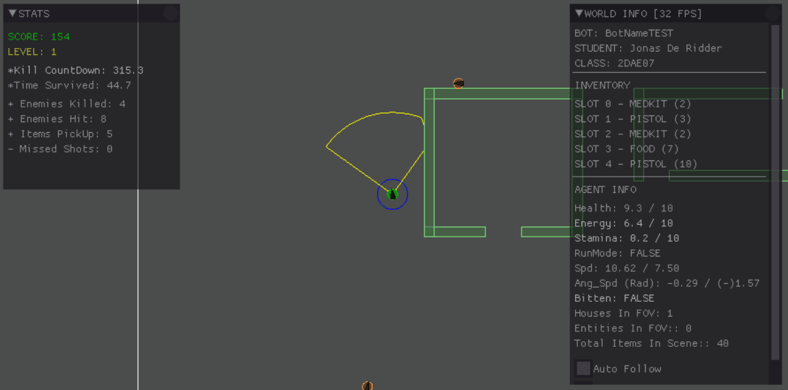

# Zombie Game AI

This project was made as part of an exam for a module called Gameplay Programming.
The goal of the project was to make an AI and to make it last as long as possible.

The game consists of zombies who will bite you, items like healthpacks, guns and food (which can be found in houses) and kill zones.
The AI should kill zombies, eat food to recover stamina and avoid the kill zones untill it can't hold up anymore against the ever increasing overwhelming enemies.

# How the AI works
The AI uses a behavior tree you will find in [Plugin.cpp](project/Plugin.cpp#L89).
This behaviour uses a blackboard to check what to agent should do each frame.

It uses the following steering behaviours:
* [Seek](project/SteeringBehaviors.h#L42)
* [Wander](project/SteeringBehaviors.h#L55)
* [Flee](project/SteeringBehaviors.h#L77)
* [Face](project/SteeringBehaviors.h#L110)

These behaviours are implemented as classes and calculate the steering behaviour each frame.

The blackboard holds the following information:
* Steering behaviours
  * Seek behaviour
  * Wander behaviour
  * Flee behaviour
  * Face behaviour
* Steering behaviour cooldowns
* Target data
* Agent info
* Agent history
* Agent inventory
* Houses info
* Locations to check
* Seen entities
* World info
* Enemies seen

To see how the [behaviour tree](project/Plugin.cpp#L89) uses the blackboard, check the methods in this [file](project/Behaviours.h)
